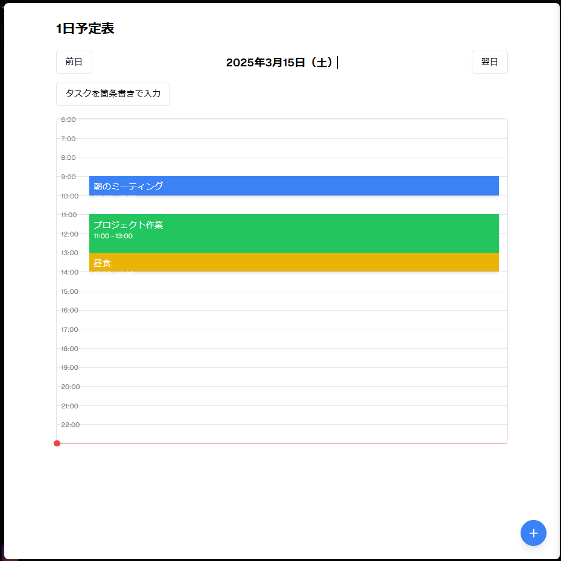

1日予定表アプリを単一のVueコンポーネントとしてまとめました。このコンポーネントは、すべての機能を含む完全なスタンドアロンコンポーネントです。

```vue project="Daily Schedule App" file="DailyScheduler.vue"
```

## 使用方法

このVueコンポーネントは、単一のファイルとして使用できます。Vue.jsプロジェクトに以下のように組み込むことができます：

1. `DailyScheduler.vue`ファイルをプロジェクトの`components`ディレクトリに保存します
2. メインのVueファイルでインポートして使用します


```vue
<template>
  <div>
    <DailyScheduler />
  </div>
</template>

<script setup>
import DailyScheduler from './components/DailyScheduler.vue'
</script>
```

## 機能一覧

このコンポーネントには以下の機能が含まれています：

1. **1日のタイムライン表示**

  1. 6時から22時までの時間を縦方向に表示
  2. 現在時刻を赤いラインで表示


2. **予定の追加・編集**

  1. タイムライン上の空き時間をクリックして新規予定を追加
  2. 既存の予定をクリックして編集
  3. 右下の「+」ボタンからも新規予定を追加可能


3. **ドラッグ＆ドロップ機能**

  1. 予定ブロックをドラッグして時間を変更
  2. ブロックの上端・下端をドラッグして予定の長さを変更


4. **日付ナビゲーション**

  1. 前日・翌日ボタンで日付を切り替え

5. **タスクの一括入力と自動配置**

  1. テキストエリアに複数のタスクを入力
  2. 入力されたタスクを自動的にタイムラインにランダム配置